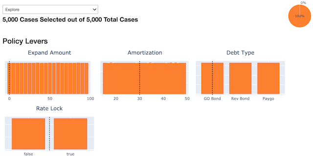
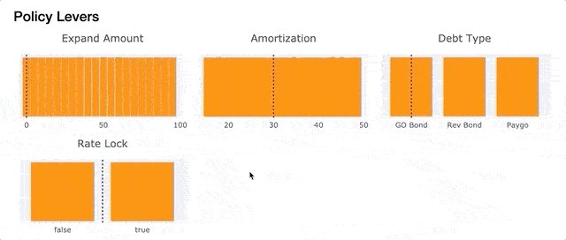
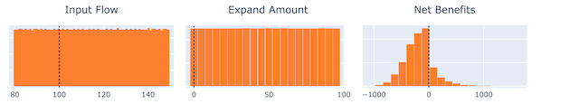
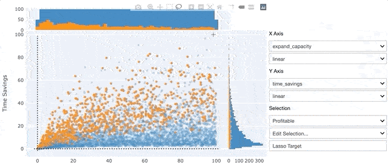
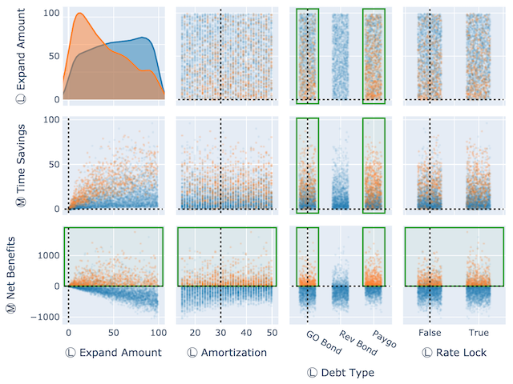

======================
Interactive Visualizer
======================

TMIP-EMAT includes an interactive visualizer, inspired by a
`similar tool <https://htmlpreview.github.io/?https://github.com/VisionEval/VisionEval/blob/master/sources/VEScenarioViewer/verpat.html>`_
provided with the `VisionEval <https://visioneval.org>`_ package.
To demonstrate the interactive visualizer, we will use the Road Test example model.
First, we need to develop and run a design of experiments to have some
data to explore.  We'll run 5,000 experiments to get a good size sample of
data points to visualize.

.. code-block:: python

    import emat.examples
    scope, db, model = emat.examples.road_test()
    design = model.design_experiments(n_samples=5000)
    results = model.run_experiments(design)

.. py:currentmodule:: emat.model

One feature of the visualizer is the ability to display not only a number of results,
but also to contrast those results against a given "reference" model that represents
a more traditional single-point forecast of inputs and results.  We'll prepare a
reference point here using the
:meth:`run_reference_experiment <AbstractCoreModel.run_reference_experiment>`
method, which reads the input parameter defaults (as defined in the scope),
and returns both inputs and outputs in a DataFrame (essentially, an experimental
design with only a single experiment), suitable for use as the reference point marker in our
visualizations.

.. py:currentmodule:: emat.analysis

.. code-block:: python

    refpoint = model.run_reference_experiment()

The interactive visualizer class can be imported from the :module:`emat.analysis` package.
To use it, we create an :class:`Visualizer` instance, giving a scope and a set of
experimental results, as well as the reference point.

.. code-block:: python

    from emat.analysis import Visualizer
    viz = Visualizer(scope=scope, data=results, reference_point=refpoint)

------------------------
Single Dimension Figures
------------------------

To build a complete interactive workspace similar to that provided by VisionEval, we
can use the :meth:`complete <Visualizer.complete>` method on the `viz` instance we created above. This will
create a set of histograms illustrating the data in the results computed above. There
is one histogram for each policy lever, exogenous uncertainty, and performance measure.

.. image:: interactive-gifs/complete2.png
    :alt: uncertainties from the "complete" set of histograms

.. image:: interactive-gifs/complete3.png
    :alt: performance measures from the "complete" set of histograms

A range of data in each histogram can be selected by dragging horizonatally across the
figure. For continuous parameters (i.e. float or integer valued parameters) you can
select a single contiguous range by dragging across that range, and deselect by double
clicking on the figure (or by selecting the entire possible range).  For discrete
parameters (i.e. boolean or categorical parameters, identifiable by the larger gaps
between the bars in the figure) dragging across the center of any bar toggles whether
that bar is selected or not.  This allows non-contiguous selections in categories that
have 3 or more possible values.  Like the other figures, any selection can be cleared
by double-clicking.

Selections can be made simultaneously over any combination of uncertainties, policy levers,
and performance measures.  The combination of controls offered can
be used interactively to select and highlight only a subset of the experiments in
the complete data set.  By manipulating these controls, users can explore the
interaction across various inputs and outputs.

It is also possible to display just a small subset of the figures of this interactive viewer.
This could be convenient, for example, if there are a very large number of performance measures.

.. code-block:: python

    viz.selectors(['input_flow', 'expand_capacity', 'net_benefits'])

-------------------
Changing Selections
-------------------

In addition to manipulating the controls interactively within the Jupyter notebook, they can also be
set programatically from Python code.  To do so, we can define a new :class:`emat.Box`
that declares lower and/or upper bounds for any continuous dimensions,
as well as the set of allowed (included) value for any discrete dimensions,
and then add that new box to this visualizer using the
:meth:`add_box <Visualizer.add_box>` command.

.. code-block:: python

    box = emat.Box("Passable", scope=scope)
    box.set_upper_bound('cost_of_capacity_expansion', 400)
    box.set_lower_bound('time_savings', 5)
    box.remove_from_allowed_set('debt_type', 'GO Bond')
    viz.add_box(box)

Alternatively, a new box can be created and added to the Visualier
with a single :meth:`new_box <Visualizer.new_box>` command, which
passes most keyword arguments through to the :class:`emat.Box` constuctor.

.. code-block:: python

    viz.new_box('Profitable', lower_bounds={'net_benefits':0})

Each of these new boxes is added to the :class:`Visualizer` seperately. You can
switch between different active boxes using the dropdown selector at the top
of the `complete` interface -- this same selector is available within the
smaller :meth:`status <Visualizer.status>` widget:

.. code-block:: python

    viz.status()

.. image:: interactive-gifs/viz-status-profitable.png
    :alt: the visualizer status display after creating the profitable box

You can also programatically find and change the active box from Python.

.. code-block:: python

    >>> viz.active_selection_name()
    'Profitable'
    >>> viz.set_active_selection_name("Passable")
    >>> viz.active_selection_name()
    'Passable'

When interactively changing bounds by dragging on figures, the currently
"active" box is modified with the revised bounds.  The entire set of
bounds can be cleared at once with the :meth:`clear_box <Visualizer.clear_box>`
method, which by default
clears the settings on the active box selection; give a name to clear the
settings from a different box selection.

If instead we want to manipulate an existing box selection, we can access the
:class:`Box <emat.Box>` object, manipulate it
(e.g. by using :meth:`remove_from_allowed_set <emat.Box.remove_from_allowed_set>`
or :meth:`add_to_allowed_set <emat.Box.add_to_allowed_set>`),
and write it back into the Visualizer.

.. code-block:: python

    box = viz['Profitable']
    box.remove_from_allowed_set('debt_type', 'Rev Bond')
    viz['Profitable'] = box

Selections can also be made that are not rectangular boxes.  One way to
do this is to write out an expression that can be evaulated using the
underlying DataFrame of experiments (with pandas' build in `eval` method).
We can pass any string that can be evaluated to :meth:`new_selection <Visualizer.new_selection>`
to create a new static selection.  When static selections are active, the
"selected" color of the figures changes from orange, to highlight the
fact that the selection is not a simple rectangular :class:`Box <emat.Box>`
and cannot be modified by dragging on figures as shown before.  But we can
still view this static selection in a number of ways, and use if for certain
types of analysis (e.g. as a target for PRIM, see below).

.. code-block:: python

    viz.new_selection(
        "time_savings * input_flow > 1000 & cost_of_capacity_expansion < 300",
        name="TimeSaved"
    )

---------------------
Two Dimension Figures
---------------------

The :class:`Visualizer` object can also create an interactive two-dimensional scatter plot,
using the :meth:`two_way <Visualizer.two_way>` method. This method allows the user to specify the variables
for both the `x` and `y` axis, and either can be any policy lever, exogenous
uncertainty, or performance measure.  These dimensions can be changed interactively
later as well.  The resulting scatter plot is linked to the same selection of
experiments in the interactive one-dimensional figures shown above, and by default
the same experiments are highlighted in the same color scheme in all of these related
figures.

.. code-block:: python

    viz.set_active_selection_name("Profitable")
    viz.two_way(x='expand_capacity', y='time_savings')

.. image:: interactive-gifs/two-way-profitable.png
    :alt: two way widget

One useful feature of the :meth:`two_way <Visualizer.two_way>` is the ability to manually "lasso" a selection of
data points. This lasso selection does *not* need to be anything like a rectangular
box selection, as we have seen so far.  Once a lasso selection of data points is made
in the figure above, you can choose "Use Manual Selection" from the `Edit Selection...`
menu at right, which will create a new :class:`Visualizer` selection from the selected data.
The highlight color changes to signify that this is not an editable rectangular box,
and the selected data will be highlighted in *all* figures linked to this :class:`Visualizer`,
including the histograms above.

In addition to the `two_way`, which offers a feature-packed view of two dimensions at a time,
there is also a scatter plot matrix :meth:`Visualizer.splom` option, which displays a configurable matrix of similar
two dimensional views.

.. code-block:: python

    viz.splom(
        rows=('expand_capacity','time_savings','net_benefits'),
        cols='L',
    )

-----------------------
Dynamic Feature Scoring
-----------------------

EMAT can score the relative importance of inputs for an experiment being within the
selection, either for a typical rectangular selection based on thresholds, or for any
arbitrary selection. These scores are recomputed and updated in near-real-time as the
thresholds are adjusted.

When the selection includes rectangular thresholds set on both inputs and outputs, the
thresholded inputs are automatically excluded from the scoring algorithm.

.. code-block:: python

    viz.selection_feature_scores()

.. image:: interactive-gifs/dyn-feature-scoring-.gif
    :alt: dynamic feature scoring

----------------
Interactive PRIM
----------------

The PRIM tools are available directly within the interactive explorer. You can use
any existing named selection as the target, whether it be created as a :class:`Box <emat.Box>`,
lasso, or from an expression. Or, you can write a new expression as the PRIM target.

.. code-block:: python

    prim = viz.prim(target="net_benefits >= 0")

The tradeoff selector is directly integrated into the explorer.  In addition
to the information visible by hovering over any point in the tradeoff selector
figure, clicking on that point will create a two new selection in the explorer,
a "Target" selection which highlights the PRIM target with the selected :class:`PrimBox`
bounds overlaid, and a "Solution" selection which converts the selected :class:`PrimBox`
into a standard :class:`emat.Box`, settinh all of the interactive constraints to the
bounds given by that particular point.  This highlights all the data points that are inside the
box, instead of those in the original target.  In this manner you can use PRIM to
manipulate the constraints on parameters to achieve a particular set of goals in a soft
manner, instead of putting hard constraints directly as the performance measure
goals.

.. code-block:: python

    prim.tradeoff_selector()

.. image:: interactive-gifs/tradeoff-selector-.gif
    :alt: tradeoff selector

We can also use PRIM to explore solutions based only on manipulating the
policy levers, and not the combination of all inputs (levers & uncertainties).

.. code-block:: python

    prim_levers = viz.prim('levers', target="Profitable")
    prim_levers.tradeoff_selector()

.. image:: interactive-gifs/tradeoff-selector-levers.png
    :alt: tradeoff selector with only levers

--------------
Visualizer API
--------------

.. autoclass:: Visualizer
    :members:
    :exclude-members:
        two_way, splom, hmm, clear_box,
        selectors, lever_selectors, uncertainty_selectors,
        measure_selectors, complete, status, prim,
        add_box, new_box, new_selection, parcoords

Manipulating Selections
~~~~~~~~~~~~~~~~~~~~~~~

.. automethod:: Visualizer.add_box
.. automethod:: Visualizer.new_box
.. automethod:: Visualizer.clear_box
.. automethod:: Visualizer.new_selection

Single Dimension Views
~~~~~~~~~~~~~~~~~~~~~~

.. automethod:: Visualizer.complete
.. automethod:: Visualizer.status
.. automethod:: Visualizer.selectors
.. automethod:: Visualizer.lever_selectors
.. automethod:: Visualizer.uncertainty_selectors
.. automethod:: Visualizer.measure_selectors

Multi Dimension Views
~~~~~~~~~~~~~~~~~~~~~

.. automethod:: Visualizer.two_way
.. autoclass:: TwoWayFigure
.. automethod:: Visualizer.splom
.. automethod:: Visualizer.hmm
.. automethod:: Visualizer.parcoords

Analytical Tools
~~~~~~~~~~~~~~~~

.. automethod:: Visualizer.prim
.. automethod:: Visualizer.selection_feature_scores